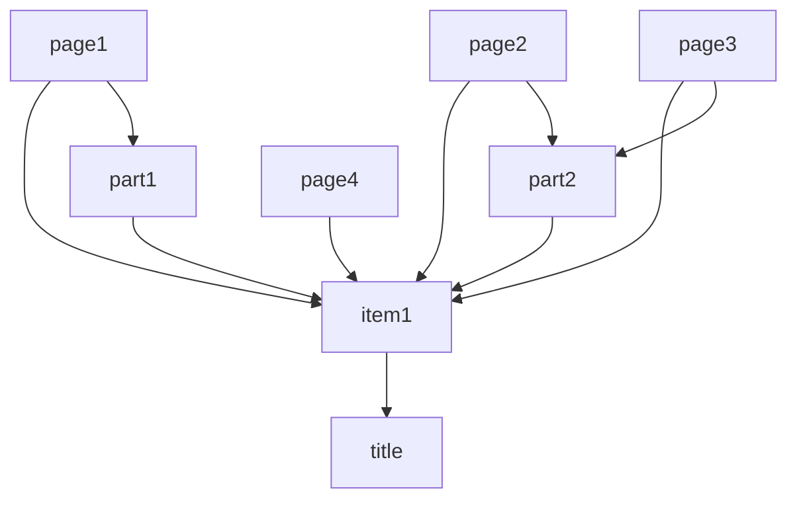

# Biodiversity Heritage Library in RDF

Crude experiments with BHL in RDF. Emphasis is on simple structure to enable queries to locate articles and taxonomic names. Almost exclusively uses [schema.org](http://schema.org).


## Triple store

Run a local triple store:

```
oxigraph_server -l oxigraph serve
```

Load triples:

```
curl 'http://localhost:7878/store?default' -H 'Content-Type:application/n-triples' --data-binary '@title.nt'

curl 'http://localhost:7878/store?default' -H 'Content-Type:application/n-triples' --data-binary '@item.nt'

curl 'http://localhost:7878/store?default' -H 'Content-Type:application/n-triples' --data-binary '@page.nt'

curl 'http://localhost:7878/store?default' -H 'Content-Type:application/n-triples' --data-binary '@all.nt'
```

## Model



### Same As

We use `schema:sameAs` to link to various resources, some of which may serve RDF. See [JSON-LD in the wild](https://github.com/rdmpage/wild-json-ld) for a relevant survey.


### Other vocabularies

`http://purl.org/library/` for `oclcnum`.
`http://purl.org/ontology/bibo/` for `doi`
`http://purl.org/spar/fabio/Page` for `Page`


