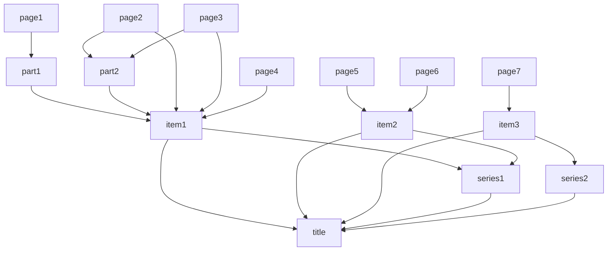

# Biodiversity Heritage Library in RDF

Crude experiments with BHL in RDF. Emphasis is on simple structure to enable queries to locate pages, articles and taxonomic names. Almost exclusively uses [schema.org](http://schema.org). 

Typical use case is resolving a [journal, volume, page] triple to the corresponding page in BHL.

## Triple store

Run a local triple store:

```
oxigraph_server -l oxigraph serve
```

Load triples:

```
curl 'http://localhost:7878/store?default' -H 'Content-Type:application/n-triples' --data-binary '@title.nt'

curl 'http://localhost:7878/store?default' -H 'Content-Type:application/n-triples' --data-binary '@item.nt'

curl 'http://localhost:7878/store?default' -H 'Content-Type:application/n-triples' --data-binary '@page.nt'

curl 'http://localhost:7878/store?default' -H 'Content-Type:application/n-triples' --data-binary '@all.nt'
```

## Model

The primary concern is the relationship between a title, its scanned volumes, and the pages and parts within those volumes. Only a small subset of metadata is included, this is all about supporting search.



### Problems with the model

An item may have more than one volume, and each volume may have more than one issue. Hence page numbers within an item may not be unique. The RDF URI is `PageID` so this is only a problem for searches based on page number (they may return multiple hits).

#### Identifying sets of issues in a volume

I’m exploring ways to identify consecutive series of page numbers within an item, see `issues.php`.

```
         I | x              
        II | x              
       III | x              
        IV | x              
         1 | xxxxxxxxxxxxxxx
         2 | xxxxxxxxxxxxxxx
         3 | xxxxxxxxxxxxxxx
         4 | xxxxxxxxxxxxxxx
         5 | xxxxxxxxxxxxxxx
         6 | xxxxxxxxxxxxxxx
         7 | xx xxxxxxxxxxxx
         8 | xx xxxxxxxxxxxx
         9 | xx xxxxxxxxxxxx
        10 | xx xxxxxxxxxx x
        11 | xx xxxxxxxxxx x
        12 | xx xxxxxxxxxx x
        13 | xx x  xxxxxxx x
        14 | xx x  xxxxxxx x
        15 | xx x  xxxxxxx x
        16 | xx x  xxxxxxx x
        17 | xx x  xxxxxxx x
        18 | xx x  xxxxxxx x
        19 | xx x  xxxxxxx x
        20 | xx x  xxxxxxx x
        21 | xx x  xxxxxxx x
        22 | xx x  xxxxxxx x
        23 | xx x  xx xxxx x
        24 | xx x  xx xxxx x
        25 | xx x   x xx x x
        26 | xx x   x x  x x
        27 | xx x   x x  x x
        28 | xx x   x x  x x
        29 | xx x   x x  x x
        30 | xx x   x x  x x
        31 | xx x   x x  x x
        32 | xx x   x x  x x
        33 | xx x   x x  x x
        34 | xx x   x x  x x
        35 | xx x   x x  x x
        36 | xx x   x x  x x
        37 | xx x   x x  x x
        38 | xx x   x x  x x
        39 | xx x   x x  x x
        40 | xx x   x x  x x
        41 | xx x   x x  x x
        42 | xx     x x  x x
        43 | xx     x x  x x
        44 | xx     x x  x x
        45 | xx     x x  x x
        46 | xx     x x  x x
        47 | xx     x x  x x
        48 | xx     x x  x x
        49 | xx     x x  x  
        50 | xx       x  x  
        51 | xx       x  x  
        52 | xx       x  x  
        53 | xx       x  x  
        54 | xx       x  x  
        55 | xx       x  x  
        56 | xx       x  x  
        57 |  x       x  x  
        58 |  x       x  x  
        59 |  x       x  x  
        60 |  x       x  x  
        61 |  x       x  x  
        62 |  x       x  x  
        63 |  x       x  x  
        64 |  x       x  x  
        65 |  x       x  x  
        66 |  x       x  x  
        67 |  x          x  
        68 |  x          x  
        69 |  x          x  
        70 |  x          x  
        71 |  x          x  
        72 |  x          x  
        73 |  x          x  
        74 |  x          x  
        75 |  x          x  
        76 |  x          x  
        77 |  x          x  
        78 |  x          x  
        79 |  x          x  
        80 |  x          x  
        81 |  x          x  
        82 |  x          x  
        83 |  x          x  
        84 |  x          x  
        85 |  x          x  
        86 |  x          x  
        87 |  x          x  
        88 |  x          x  
   Plate 1 |  xx  xx xx x  x
   Plate 2 |  x   x  xx x  x
   Plate 3 |  x   x  xx x  x
   Plate 4 |  x   x  xx x  x
   Plate 5 |  x   x  xx    x
   Plate 6 |  x   x  xx    x
   Plate 7 |  x   x   x     
   Plate 8 |  x   x   x     
   Plate 9 |  x       x     
  Plate 10 |  x       x     
  Plate 11 |          x     
  Plate 12 |          x     
  Plate 13 |          x     
  Plate 14 |          x     
  Plate 15 |          x     
  Plate 16 |          x     
  Plate 17 |          x     
  Plate 18 |          x     
  Plate 19 |          x     
  Plate 20 |          x     
  Plate 21 |          x     
  Plate 22 |          x     
  Plate 23 |          x     
  Plate 24 |          x     
  Plate 25 |          x     
  Plate 26 |          x     
  Plate 27 |          x     
  Plate 28 |          x     
  Plate 29 |          x     
  Plate 30 |          x     
  Plate 31 |          x     
     Plate |              x 

```

#### series

There are bibliographic units that sit between title and item, such as “series”. Knowing which series a volume (and hence an item) belongs to can be vital for locating pages.

### isPartOf

Items (e.g., volumes) are parts of titles (e.g., journals or books), pages are parts of items, and some pages are parts of parts (e.g., articles, book chapters, etc.). Series are part of titles, and items are parts of series.

### sameAs

We use `schema:sameAs` to link to various resources, some of which may serve RDF. See [JSON-LD in the wild](https://github.com/rdmpage/wild-json-ld) for a relevant survey.


### Other vocabularies

`http://purl.org/library/` for `oclcnum`.
`http://purl.org/ontology/bibo/` for `doi`
`http://purl.org/spar/fabio/Page` for `Page`


### Queries

#### Series, volume, page (e.g., Ann. Mag. nat. Hist. )
```
PREFIX fabio: <http://purl.org/spar/fabio/>
PREFIX dc: <http://purl.org/dc/elements/1.1/>
PREFIX schema: <http://schema.org/>
PREFIX rdf: <http://www.w3.org/1999/02/22-rdf-syntax-ns#>
PREFIX rdfs: <http://www.w3.org/2000/01/rdf-schema#>
SELECT * WHERE {
  # Ann. Mag. nat. Hist. (3)3: 212.
  VALUES ?title { <https://www.biodiversitylibrary.org/bibliography/15774> }
  VALUES ?series_name  { "3"} .
  VALUES ?volume_number  { "3"} .
  VALUES ?page_number  { "212"} .
   
  ?series schema:isPartOf ?title .
  ?series rdf:type schema:CreativeWorkSeries . 
  ?series schema:name ?series_name .
  
  ?volume schema:isPartOf ?series .    
  ?volume schema:isPartOf ?title .  
  ?volume schema:volumeNumber ?volume_number .

  ?page schema:isPartOf ?volume .
  ?page rdf:type fabio:Page .
  ?page schema:name ?page_number .
  
} 
```

#### x
```
PREFIX dc: <http://purl.org/dc/elements/1.1/>
PREFIX schema: <http://schema.org/>
PREFIX rdf: <http://www.w3.org/1999/02/22-rdf-syntax-ns#>
PREFIX rdfs: <http://www.w3.org/2000/01/rdf-schema#>
SELECT * WHERE {
  VALUES ?title { <https://www.biodiversitylibrary.org/bibliography/15774> }
  ?series schema:isPartOf ?title .
  ?series rdf:type schema:CreativeWorkSeries . 
  ?series schema:name "9" .
  
  ?volume schema:isPartOf ?series .  
  
  ?volume schema:isPartOf ?title .  
  ?volume schema:name ?name .
  ?volume schema:volumeNumber ?number .
  
  OPTIONAL {
    ?volume schema:datePublished ?datePublished .
  }
  
 
  
} 
```


